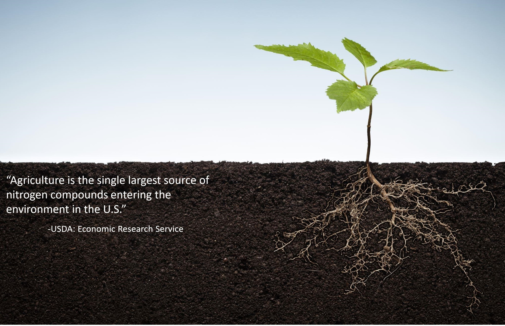
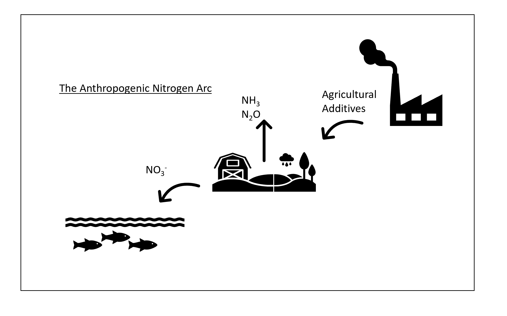

```{r setup, include=FALSE}
library("xtable")
library("data.table")
library("shiny")
library("readxl")
library("tidyverse")
```


```{r global}
## Read in the datasets
## This is the chemical compound dataset
tab1 <- read_excel("data/Compounds_complete.xlsx", sheet = 1)
tab <- arrange(tab1, Compound)
colnames(tab)[1:10] <- c("Compound", "Formula", "MW", "SMILES", "Synonyms", "CAS", "imgurl", "rxnurl", "CN_Ratio", "Cost/metric ton")
```

Home
=====================================
Column {.sidebar}
-----------------------------------------------------------------------

**Welcome to The Organonitrogen Degradation Database (ON-DB)**
<br>
<br>
**Our Mission:**
<br>
*Cataloguing microbial transformations of organonitrogen inputs in soils*
<br>
<br>
Organonitrogen compounds are a major soil input used for fertilizers, pesticides and other agricultural purposes. One such compound, urea, is predicted to reach 1.87 x 10e11 kg by 2021 (International Fertilizer Association, 2017), and recent findings suggest these compounds can increase productivity and decrease environmental impacts. The intent of the ON-DB is to aid in bioremediation efforts by providing information on nitrogen-rich compounds.  
<br>
<br>
Last updated: July 2020

Column 
-----------------------------------------------------------------------
```{r, out.width = "100%"}

```

About
===================================== 
Column {.sidebar}
-----------------------------------------------------------------------

***

```{r, out.width = "100%"}

```
<br>

***

```{r, out.width = "100%"}

```
<br>

***

```{r, out.width = "100%"}

```
<br>

***


Inputs 
-----------------------------------------------------------------------

***

The Organonitrogen Degradation Database (ON-DB) is a catalog of agriculturally applied nitrogen compounds. The scope of the database is to provide a thorough understanding of the pathways, reactions, bacteria, and enzymes involved in organonitrogen degradation in soil. 

Organonitrogen compounds, applied directly to the soil in bulk quantities either as fertilizers or as pesticides, can be leached from the soil and transported to waterways and aquifers. It is estimated that over 80% of nitrogen is lost to the environment (Sutton et al. 2013). This nitrogen is known to cause ecosystem imbalances such as heightened pH and eutrophication. A better understanding of the microbial transformations of organonitrogen compounds provides researchers the ability to remediate potential hazards. 

To better understand the fate of these compounds, we have compiled information regarding their biodegradation. Selecting any compound listed in the database will provide information such as general overview, basic chemical information, common use, transformation products, enzymes and bacteria capable of degradation.

The Organonitrogen Degradation Database, with a wealth of information, has room to be added, too. The ON-DB is a great resource for lecture groups to contribute to and utilize. Lecturers are able to utilize this database in their lesson plans for several learning objectives including:

* Understanding microbial degradation
* Bioremediation tactics
* Understanding the role of enzymes
* Further investigations for the use and importance of computational research
* Practice working through the scientific steps 

This site is maintained by Dr. Larry Wackett’s lab at the University of Minnesota. We gratefully acknowledge support from the UMN Institute on the Environment, BioTechnology Institute, and Grand Challenges Initiative. The Organonitrogen Degradation Database was designed in collaboration with Hamline University.

Disclaimer: Any opinions expressed within the Organonitrogen Degradation Database are not reflective of any affiliated outside organization and neither are the opinions of outside organizations reflective of this organization.        


Last updated: July 2020

***

```{r, out.width = "100%"}

```


Resources
===================================== 
Column {.sidebar}
-----------------------------------------------------------------------

**Resources, links, and references**
<br>
<br>
Located on the right and found below are the resources and citations relevant to the compounds listed in the ON-DB. These resources can serve as a point of further investigation. 
<br>
<br>
Last updated: July 2020

Inputs
-----------------------------------------------------------------------

***

**Web Resources**

<u>Agricultural and fertilizer information:</u>

* [International Fertilizer Association](https://www.fertilizer.org/statistics)

* [Urea Fertilizer – University of Minnesota Extension](https://extension.umn.edu/nitrogen/fertilizer-urea)

* [Nutrient Loss Database for Agricultural Fields and Forests in the United States](https://www.ars.usda.gov/plains-area/temple-tx/grassland-soil-and-water-research-laboratory/docs/manage-nutrient-loss-database/)

* [USDA – Fertilizer Use in the United States](https://www.ers.usda.gov/data-products/fertilizer-use-and-price.aspx)

<u>Pathway information:</u>

* [EAWAG - Biocatalysis and Biodegradation Database](http://eawag-bbd.ethz.ch/predict/)

* [MetaCyc - Metabolic Pathway Database](https://metacyc.org/)

* [Uniprot - Universal Protein Resource](https://www.uniprot.org/)

<u>Enzyme and gene information:</u>

* [Expasy - Bioinformatics Resource Portal](https://enzyme.expasy.org/)

* [KEGG - Kyoto Encyclopedia of Genes and Genomes](https://www.genome.jp/kegg/kegg2.html)

<u>Compound information:</u>

* [Pubchem - Chemistry Database](pubchem.ncbi.nlm.nih.gov)

* [ChemSpider- Royal Society for Chemistry](http://www.chemspider.com/)

* [NPIC - National Pesticide Information Center](http://npic.orst.edu/)

***

**Scientific Publications**

1. Ahmed, Moddassir, et al. "Hazards of Nitrogen Fertilizers and Ways to Reduce Nitrate Accumulation in Crop Plants." Environmental Science and Pollution Research International, vol. 27, no. 15, 2020, pp. 17661-17670. PubMed, https://www.ncbi.nlm.nih.gov/pubmed/32180142, doi:10.1007/s11356-020-08236-y.
2. Amberger, A. “Cyanamide in plant metabolism” International Journal of Plant Physiology and Biochemistry Vol. 5, no. 1, 2013, pp. 1-10
3. Amberger, A., and M. P. Germann-Bauer. "Effect of the Nitrification Inhibitors 1-Amidino-2-Thiourea and Dicyandiamide in Combination with Urea and Ammonium Sulfate." Fertilizer Research, vol. 21, no. 3, 1990, pp. 179-183. CrossRef, doi:10.1007/BF01087429.
4. Amtul, Z. et al. “Chemistry and mechanism of urease inhibition” Current Medicinal Chemistry, vol. 9, no. 14, 2002, pp. 1323-1348 
5. Brady, D. et al. “Characterization of nitrilase and nitrile hydratase biocatalytic systems” Applied Microbiology and Biotechnology, vol. 64, 2003, pp.  76-85
6. Cheng, G. et al. “Allophanate hydrolase, not urease, functions in bacterial cyanuric acid metabolism” Applied and Environmental Microbiology, vol. 71 no. 8, 2005, pp.  4437-4445
7. Cox, G. et al. “Urease as a virulence factor in experimental Cryptococcus” Infection and Immunity, vol. 68, no. 2, 2000, pp. 443-448s
8. DeMaster, E. Shirota, F. & Nagasawa, H. “The metabolic activation of cyanamide to an inhibitor of aldehyde dehydrogenase is catalyzed by catalase” Biochemical and Biophysical Research Communications, vol. 122, no. 1, 1984,  pp.  358-365
9. Doomkaew, A., Prutthiwanasan, B., Suntornsuk, L. “Simultaneous analysis of metformin and cyanoguanidine by capillary zone electrophoresis and its application in a stability study” Journal of Separation Science, vol. 37, no. 13, 2014, pp. 1687-93
10. Duncan, Elliott G., et al. "A Composite Guanyl Thiourea (GTU), Dicyandiamide (DCD) Inhibitor Improves the Efficacy of Nitrification Inhibition in Soil." Chemosphere, vol. 163, 2016, pp. 1-5. MEDLINE, http://dx.doi.org/10.1016/j.chemosphere.2016.07.103, doi:10.1016/j.chemosphere.2016.07.103.
11. Esquirol, Lygie, et al. "Structural and Biochemical Characterization of the Biuret Hydrolase (BiuH) from the Cyanuric Acid Catabolism Pathway of Rhizobium Leguminosarum Bv. Viciae 3841." PloS One, vol. 13, no. 2, 2018, pp. e0192736. PubMed, https://www.ncbi.nlm.nih.gov/pubmed/29425231, doi:10.1371/journal.pone.0192736.
12. Esquirol, Lygie, et al. "Structural and Biochemical Characterization of the Biuret Hydrolase (BiuH) from the Cyanuric Acid Catabolism Pathway of Rhizobium Leguminosarum Bv. Viciae 3841." PloS One, vol. 13, no. 2, 2018, pp. e0192736. PubMed, https://www.ncbi.nlm.nih.gov/pubmed/29425231, doi:10.1371/journal.pone.0192736.
13. Estermaier, L. et al. “Biochemical degradation of cyanamide and dicyandiamide” Angewandte Chemie, International Ed., vol. 31, no.  5, 1992, pp.  620-622
14. Gang Cheng, et al. "Allophanate Hydrolase, Not Urease, Functions in Bacterial Cyanuric Acid Metabolism." Applied and Environmental Microbiology, vol. 71, no. 8, 2005, pp. 4437-4445. MEDLINE, http://aem.asm.org/content/71/8/4437.abstract, doi:10.1128/AEM.71.8.4437-4445.2005.
15. Gezerman, Ahmet O. “Effects of Ammonium Thiosulfate and Guanyl Thiourea as Calcium Ammonium Nitrate Inhibitors on Fertilization and Plants.” Chemical Review and Letters, vol 2, 2019, pp. 84-89. ISSN (online): 2645-4947 
16. Guo, L. et al. “Biodegradation of the neonicotinoid insecticide acetamiprid by actinomycetes Streptomyces canus GCMCC 13662  and characterization of the novel nitrile hydratase involved” Journal of Agricultural and Food Chemistry, vol. 67, no. 21, 2019, pp. 5922-5931
17. Hallinger, S et al. “Several aspects of bacterial dicyandiamide degradation” The Science of Nature vol. 77 (1990): 332-334
18. Hausinger, R. “Metabolic versatility of prokaryotes for urea consumption” Journal of Bacteriology, vol. 186, no. 9, 2004, pp. 2520-2522
19. Hayes, J.T. and Haden, W.W. “Effect of structure on nitrification of urea derivatives” Journal of Agricultural and Food Chemistry, vol. 17, no. 51969, pp. 1077-1079
20. Hideharu Hagiya, et al. "Clinical Characteristics of Ochrobactrum Anthropi Bacteremia." Journal of Clinical Microbiology, vol. 51, no. 4, 2013, pp. 1330-1333. MEDLINE, http://jcm.asm.org/content/51/4/1330.abstract, doi:10.1128/JCM.03238-12.
 
21. Hu, Hang-Wei, Deli Chen, and Ji-Zheng He. "Microbial Regulation of Terrestrial Nitrous Oxide Formation: Understanding the Biological Pathways for Prediction of Emission Rates." FEMS Microbiology Reviews, vol. 39, no. 5, 2015, pp. 729-749. MEDLINE, https://www.ncbi.nlm.nih.gov/pubmed/25934121, doi:10.1093/femsre/fuv021.
22. Jahns, T. and Kaltwasser, H. “Mechanism of metabolism in slow-release fertilizers” Journal of Polymers and the Environment, vol. 8, no. 1, 2000, pp. 11-16
23. Jahns, T. et al. “Microbial urea-formaldehyde degradation involves a new enzyme, Methylenediurease” Acta Biologica Hungarica, vol. 49, no. 2-4, 1998, pp. 449-454
24. Jahns, T., Ewen, H., and Kaltwasser, H. “Biodegradability of urea-aldehyde degradation products” Journal of Polymers and the Environment, vol. 11, no. 4, 2003, pp. 155-159
25. Jahns, Thomas, and Heinrich Kaltwasser. "Mechanism of Microbial Degradation of Slow-Release Fertilizers." Journal of Polymers and the Environment, vol. 8, no. 1, 2000, pp. 11-16. Materials Research Database, https://search.proquest.com/docview/758766264, doi:10.1023/A:1010116027139.
26. Jahns, Thomas, et al. “Microbial Urea-Formaldehyde Degradation Involves a New Enzyme, Methylenediurease.” Acta Biologica Hungarica, vol. 49, no. 2-4, 1998, pp. 449-454. Minitex
27. Jahns, Thomas, et al. “Purification and Characterization of an Enzyme From a Strain of Ochrobactrum anthropi That Degrades Condensation Products of Urea and Formaldehyde (Ureaform).” Canadian Journal of Microbiology, vol. 43, no. 12, 1997, pp. 1111-1117. Minitex
28. Kanamori et al. “Allophanate hydrolase of Oleomonas sagaranensis involved in an ATP-dependent degradation pathway specific to urea” FEMS Microbiology Letters, vol. 245, 2005, pp. 61-65
29. Kanamori, T. et al. “Enzymatic characterization of a prokaryotic urea carboxylase” Journal of bacteriology vol. 186, no. 9, 2004, pp. 2532-2539
30. Kandeler, E., Stemmer, M. & Klimanek, E-M. “Response of soil microbial biomass, urease and xylanase within particle-sized fractions to long-term soil management” Soil Biology and Biochemistry, vol. 31, 1999, pp.  261-273
31. Koch, H. et al. “Expanded metabolic versatility of ubiquitous nitrite-oxidizing bacteria from the genus Nitrospira” Proceedings of the National Academy of Sciences, vol. 112, no. 36, 2015, pp. 11371-11376
32. Koivunen, M. E., et al. "Isolation of a Strain of Agrobacterium Tumefaciens (Rhizobium Radiobacter) Utilizing Methylene Urea (Ureaformaldehyde) as Nitrogen Source." Canadian Journal of Microbiology, vol. 50, no. 3, 2004, pp. 167-174. MEDLINE, http://www.ingentaconnect.com/content/nrc/cjm/2004/00000050/00000003/art00002, doi:10.1139/w04-001.
33. Koivunen, Marja E., et al. "Purification and Characterization of a Methylene Urea-Hydrolyzing Enzyme from Rhizobium Radiobacter ( Agrobacterium Tumefaciens)." Soil Biology and Biochemistry, vol. 35, no. 11, 2003, pp. 1433-1442. CrossRef, http://dx.doi.org/10.1016/S0038-0717(03)00237-2, doi:10.1016/S0038-0717(03)00237-2.
34. Koivunen, Marja, and William Horwath. "Effect of Management History and Temperature on the Mineralization of Methylene Urea in Soil." Nutrient Cycling in Agroecosystems, vol. 68, no. 1, 2004, pp. 25-35. CrossRef, https://search.proquest.com/docview/2259822406, doi:10.1023/B:FRES.0000012232.56756.f0.
35. Koivunen, Marja, and William Horwath. "Methylene Urea as a Slow-Release Nitrogen Source for Processing Tomatoes." Nutrient Cycling in Agroecosystems, vol. 71, no. 2, 2005, pp. 177-190. CrossRef, https://search.proquest.com/docview/2259652954, doi:10.1007/s10705-004-2214-7.
36. Krajewska, B. “Urease-aided calcium carbonate mineralization for engineering application: a review” Journal of Advanced Research, vol. 13, 2018, 59-67
37. Kurzer Frederick. “Biuret and Related Compounds.” Royal Free Hospital School of Medicine, 1955.
38. Li, J. et al. “Two duplicated genes DDI2 and DDI3 in budding yeast encode a cyanamide hydratase and are induced by cyanamide” Journal of Biological Chemistry, vol. 290, no. 20, 2015, 12664-12675e
39. Lvov, Y. et al. “Urease encapsulation in nanoorganized microshells” Nano Letters, vol. 1, no. 3, 2001, pp.  125-128
40. Maier-Greiner et al. “Isolation and properties of a nitrile hydratase from the soil fungus Myrothecium verrucaria that is highly specific for the fertilizer cyanamide and cloning of its gene” Proceedings of the National Academy of Sciences, vol. 88, no. 10, 1991, pp. 4260-4264
41. Martinez, B., et al. "Complete Nucleotide Sequence and Organization of the Atrazine Catabolic Plasmid pADP-1 from Pseudomonas Sp. Strain ADP." Journal of Bacteriology, vol. 183, no. 19, 2001, pp. 5684-5697. MEDLINE, https://www.ncbi.nlm.nih.gov/pubmed/11544232, doi:10.1128/JB.183.19.5684-5697.2001.
42. Martinez, et al. “Complete nucleotide sequence and organization of the atrazine catabolic plasmid pADP-1 from Pseudomonas sp. strain ADP” Journal of Bacteriology, vol. 183, no. 19, 2001, pp. 5684-5697
43. Martin-Hendrie, D. “Factors affecting the degradation of nitrification inhibitor dicyandiamide in a lowland Canterbury stream” Dissertation at Lincoln University, New Zealand. 2014
44. McCarty, G. “Modes of action of nitrification inhibitors” Biology and Fertility of Soils, vol. 29, 1999, pp. 1-9
45. Minet, E.P. et al. “Slow delivery of a nitrification inhibitor (dicyandiamide) to soil using a biodegradable hydrogel of chitosan” Chemosphere, vol. 93, 2013, pp. 2854-2858
46. Mobley, H. & Hausinger, R. “Microbial ureases: Significance, regulation and molecular characterization” Microbiological Reviews, vol. 53, no. 1, 1989, pp. 85-108
47. Mulrooney, S. & Hausinger, R. “Nickel uptake and utilization by microorganisms” FEMS Microbiology Reviews, vol. 27, nos. 2-3, 2003, pp. 239-261
48. National Center for Biotechnology Information. PubChem Database. Urea, CID: 1176, https://pubchem.ncbi.nlm.nih.gov/compound/Urea
49. National Center for Biotechnology Information. PubChem Database. Methylenediurea, CID=61645, https://pubchem.ncbi.nlm.nih.gov/compound/Methylenediurea (accessed on June 6, 2020)
50. National Center for Biotechnology Information. PubChem Database. Cyanoguanidine, CID=10005, https://pubchem.ncbi.nlm.nih.gov/compound/Cyanoguanidine (accessed on Feb. 16, 2020)
51. National Institute for Occupational Safety and Health. RTECS Database. Guanidine, Cyano-, https://www.cdc.gov/niosh-rtecs/ME97D330.html (accessed on Feb. 16, 2020)
52. Robinson, Serina L., et al. "Microbial Biodegradation of Biuret: Defining Biuret Hydrolases within the Isochorismatase Superfamily." Environmental Microbiology, vol. 20, no. 6, 2018, pp. 2099-2111. PubMed, https://onlinelibrary.wiley.com/doi/abs/10.1111/1462-2920.14094, doi:10.1111/1462-2920.14094.
53. Rodgers, G., Wickramasinghe, K. Jenkinson, D. “Mineralization of soils, labeled with N-15, in soils” Soil Biology and Biochemistry, vol. 17, 1985, pp. 253-254
54. Sahu, Sandhyamayee, et al. "Oxidation of Thiourea and Substituted Thioureas: A Review." Journal of Sulfur Chemistry, vol. 32, no. 2, 2011, pp. 171-197. CrossRef, http://www.tandfonline.com/doi/abs/10.1080/17415993.2010.550294, doi:10.1080/17415993.2010.550294.
55. Sahwarat, K. “Effect of biuret content on transformation of urea nitrogen in soil” Soil Biology and Biochemistry, vol. 9, 1976, pp. 173-175
56. Salis, R K et al. “High-throughput amplicon sequencing and stream benthic bacteria: identifying the best taxonomic level for multiple-stressor research.” Scientific reports, vol. 7, 2017
57. Schwarzer et al. “Physiological and electron microscopical investigations on syntrophic dicyandiamide degradation by soil bacteria” Soil Biology and Biochemistry, vol. 30, no. 3, 1998, pp. 385-391
58. Shapir et al. “Purification and characterization of TrzF: biuret hydrolysis by allophanate hydrolase supports growth” Applied and Environmental Biology, vol. 72 no. 4, 2006, pp. 2491-2495 
59. Shapir, N., Sadowsky, M. & Wackett, L. “s” Journal of Bacteriology, vol. 187 no. 11, 2005, pp. 3731-3738
60. Shi, K. et al. “Effects of calcium cyanamide on soil microbial communities and Fusarium oxysporum f. sp. cucumberinum” Chemosphere, vol. 75, no. 7, 2009, pp. 872-877
61. Smith, I & Schallenberg, M. “Occurrence of the agricultural nitrification inhibitor, dicyandiamide, in surface waters and its effects on nitrogen dynamics in an experimental aquatic system” Agriculture, Ecosystems and Environment, vol. 164, 2013, pp. 23-31
62. Sutton M.A. et al. “Our Nutrient World: The challenge to produce more food and energy with less pollution.” Global Overview of Nutrient Management. Centre for Ecology and Hydrology, Edinburgh on behalf of the Global Partnership on Nutrient Management and the International Nitrogen Initiative. (2013)
63. Tabatabai, M. & Bremner, J. “Assay of urease activities in soil” Soil Biology and Biochemistry, vol. 4, 1972 pp. 479-487
64. Tang, Hubert P. O., et al. "Improved Method for the Determination of Cyanuric Acid in Animal Feed by GC–MS." Chromatographia, vol. 70, no. 9-10, 2009, pp. 1405-1410. CrossRef, doi:10.1365/s10337-009-1315-5.
65. Teaumroong, N. et al. “A non-radioactive DNA probe for detecting dicyandiamide-degrading soil bacteria” Biology and Fertility of Soils, vol. 25, 1997, pp. 159-162
66. Trenkl, Martin E. “ Improving Fertilizer Use Efficiency: Controlled-Release and Stabilized Fertilizers in Agriculture” International Fertilizer Industry Association, 1997, pp. 7-70
67. Varadachari, C and Goertz, H. “Slow-release and controlled-release nitrogen fertilizers” ING Bulletins on Regional Assessment of Reactive Nitrogen, Bulletin No. 11, (Ed. Bijay Singh), SCON-ING, New Delhi, (2010): i-iv & 1-42
68. Varadachari, Chandrika, and Harvey Goertz M. Slow-Release and Controlled-Release Nitrogen Fertilizers. Indian Nitrogen Group and Society for Conservation of Nature, 2010.
69. Veaudor, T., Cassier-Chauvat, C. & Chauvat, F. “Genomics of urea transport and catabolism in cyanobacteria: biotechnological implications” Frontiers in Microbiology Vol. 10, 2052 (2019)
70. Wang, Yuan, et al. "Inhibitory Effect of Thiourea on Biological Nitrification Process and its Eliminating Method." Water Science and Technology, vol. 75, no. 12, 2017, pp. 2900-2907. PubMed, https://www.ncbi.nlm.nih.gov/pubmed/28659530, doi:10.2166/wst.2017.177.


Database
===================================== 


Inputs {.sidebar data-width=150}
-----------------------------------------------------------------------

```{r}

      # selectizeInput("compound", label = "Search by compound name:",
      #               choices = c(sort(tab$Compound)),
      #                selected = NA, multiple = TRUE
      # )
```

***

```{r}
      
      textInput("search", label = "Search by keyword:",
                placeholder = 'e.g. Biuret'
      )

```

***

Outputs
-----------------------------------------------------------------------
```{r}   
 renderTable({
      srch <- tab[grep(input$search, tab$Synonyms),]
      srchlower <- paste0(tolower(substring(input$search, 1, 1)), 
                          substring(input$search, 2))
      srch2 <- tab[grep(srchlower, tab$Synonyms),]
      srchupper <- paste0(toupper(substring(input$search, 1, 1)), 
                          substring(input$search, 2))
      srch3 <- tab[grep(srchupper, tab$Synonyms),]
      # cmpd <- tab[tab$Compound %in% input$compound,]
      out <- data.frame(rbind(
        # cmpd, 
        srch, srch2, srch3
                              ))
      dedup <- out[!duplicated(out),]
      return(xtable(dedup[,c(1:5, 9, 10)]))

    })
```   

Reactions
=====================================
<br>

    
Column {.sidebar}
-----------------------------------------------------------------------

***

Click on a compound to see its reaction(s):

***

<!-- Allophanate -->
```{r} 
  tags$button(
        id = "Allophanate",
        class = "btn action-button",
        tags$img(src = tab$imgurl[tab$Compound == "Allophanate"],
                 width = "175px")
      )
```

<br>


<!-- Biuret -->
```{r, out.width = "250px"} 
      tags$button(
        id = "Biuret",
        class = "btn action-button",
        tags$img(src = tab$imgurl[tab$Compound == "Biuret"],
                 width = "175px")
      )   
```

<br>


<!-- Cyanamide    -->
```{r}
    tags$button(
        id = "Cyanamide",
        class = "btn action-button",
        tags$img(src = tab$imgurl[tab$Compound == "Cyanamide"],
                 width = "175px")
      )  
```

<br>


<!-- Cyanoguanidine -->
```{r, out.width = "250px"} 
      tags$button(
        id = "Cyanoguanidine",
        class = "btn action-button",
        tags$img(src = tab$imgurl[tab$Compound == "Cyanoguanidine"],
                 width = "175px")
      )   
```

<br>


<!-- Cyanuric acid -->
```{r, out.width = "250px"} 
      tags$button(
        id = "Cyanuric_acid",
        class = "btn action-button",
        tags$img(src = tab$imgurl[tab$Compound == "Cyanuric acid"],
                 width = "175px")
      )

```

<br>


<!-- Guanyl thiourea -->
```{r, out.width = "250px"} 
      tags$button(
        id = "Guanyl_thiourea",
        class = "btn action-button",
        tags$img(src = tab$imgurl[tab$Compound == "Guanyl thiourea"],
                 width = "175px")
      )   
```

<br>


<!-- Methylenediurea -->
```{r, out.width = "250px"} 
      tags$button(
        id = "Methylenediurea",
        class = "btn action-button",
        tags$img(src = tab$imgurl[tab$Compound == "Methylenediurea"],
                 width = "175px")
      ) 

```

<br>


<!-- Urea -->
```{r, out.width = "250px"} 
    tags$button(
        id = "Urea",
        class = "btn action-button",
        tags$img(src = tab$imgurl[tab$Compound == "Urea"],
                 width = "175px")
      )
```

Column 
-----------------------------------------------------------------------
```{r, out.width = "250px"}   

rv <- reactiveValues(img = 'www/np_dwnloads/white.png', 
                     img2 = 'www/np_dwnloads/white.png',
                     img3 = 'www/np_dwnloads/white.png',
                     tbl = read.delim('data/table_default.txt')
)

  observeEvent(input$Urea, {
    rv$tbl <- read.delim("data/Urea.txt")   
    rv$img <- paste0("www/Urea urease reaction.jpg")
    rv$img2 <- paste0("www/Urea carboxylase reaction.jpg")
    rv$img3 <- paste0("www/np_dwnloads/white.png")
  })
  
  observeEvent(input$Cyanuric_acid, {
    rv$tbl <- read.delim("data/Cyanuric_acid.txt")
    colnames(rv$tbl) <- "Cyanuric acid"
    rv$img <- paste0("www/Cyanuric acid reaction.jpg")
    rv$img2 <- paste0("www/np_dwnloads/white.png")
    rv$img3 <- paste0("www/np_dwnloads/white.png")
  })

  observeEvent(input$Cyanamide, {
    rv$tbl <- read.delim("data/Cyanamide.txt")
    rv$img <- paste0("www/Cyanamide hydratase reaction.jpg")
    rv$img2 <- paste0("www/Cyanamide urease reaction.jpg")
    rv$img3 <- paste0("www/np_dwnloads/white.png")
  })
  
    observeEvent(input$Biuret, {
    rv$tbl <- read.delim("data/Biuret.txt")
    rv$img <- paste0("www/Biuret reaction.jpg")
    rv$img2 <- paste0("www/np_dwnloads/white.png")
    rv$img3 <- paste0("www/np_dwnloads/white.png")
  })
  
    observeEvent(input$Allophanate, {
    rv$tbl <- read.delim("data/Allophanate.txt")
    rv$img <- paste0("www/Allophanate reaction.jpg")
    rv$img2 <- paste0("www/np_dwnloads/white.png")
    rv$img3 <- paste0("www/np_dwnloads/white.png")
  })
    
    observeEvent(input$Cyanoguanidine, {
    rv$tbl <- read.delim("data/Cyanoguanidine.txt")
    rv$img <- paste0("www/Cyanoguanidine reaction 1.jpg")
    rv$img2 <- paste0("www/Cyanoguanidine reaction 2.jpg")
    rv$img3 <- paste0("www/Cyanoguanidine reaction 3.jpg")
  })
    
    observeEvent(input$Methylenediurea, {
    rv$tbl <- read.delim("data/Methylenediurea.txt")
    rv$img <- paste0("www/Methylenediurea reaction.jpg")
    rv$img2 <- paste0("www/np_dwnloads/white.png")
    rv$img3 <- paste0("www/np_dwnloads/white.png")
  })
    
    observeEvent(input$Guanyl_thiourea, {
    rv$tbl <- read.delim("data/Guanyl_thiourea.txt")
    colnames(rv$tbl) <- "Guanyl thiourea"
    rv$img <- paste0("www/Guanyl thiourea reaction.jpg")
    rv$img2 <- paste0("www/np_dwnloads/white.png")
    rv$img3 <- paste0("www/np_dwnloads/white.png")
  })    
  output$img1 <- renderImage({
   list(src = rv$img)
}, deleteFile = FALSE)
  
  output$img2 <- renderImage({
   list(src = rv$img2)
}, deleteFile = FALSE)
  
  output$img3 <- renderImage({
   list(src = rv$img3)
}, deleteFile = FALSE)  
 
  
  
# shiny::renderUI(HTML(rv$tbl))
# output$tbl <- 
  renderTable({
  
tbl1 <- rv$tbl
tbl1
},
# align = c("llr"),
sanitize.text.function = function(x) x)
# tableOutput("tbl")
```

<!-- <div class = "row"> -->
<!-- <div class = "col-md-6"> -->
<!-- <center> -->
<div class="row">
  <div class="col-sm-4">

<!-- Reaction 1: -->
```{r, out.width = "100px"}
imageOutput("img1", width = "75px")
```  
</div>
<!-- </center> -->
<!-- </div> -->

<!-- <div class = "col-md-6"> -->
<!-- <center> -->
  <div class="col-sm-4">

<!-- Reaction 2: -->
```{r, out.width = "100px"}
imageOutput("img2")
```  
</div>
<!-- </center> -->
<!-- </div> -->

<!-- <div class = "col-md-6"> -->
<!-- <center> -->
  <div class="col-sm-4">

<!-- Reaction 3: -->
```{r, out.width = "100px"}
imageOutput("img3")
```  
</div>
<!-- </center> -->
<!-- </div> -->
<!-- </div> -->
</div>


<!-- Acknowledgements -->
<!-- ===================================== -->

<!-- Column {.sidebar} -->
<!-- ----------------------------------------------------------------------- -->
<!-- <br> -->
<!-- <br> -->
<!-- <br> -->
<!-- This site is maintained by [Dr. Larry Wackett's lab](https://cbs.umn.edu/wackett-lab/home) at the University of Minnesota.  -->
<!-- <br> -->
<!-- <br> -->
<!-- We gratefully acknowledge support from the UMN Institute on the Environment, BioTechnology Institute, and Grand Challenges Initiative. The Urea Fate & Degradation Database was designed in collaboration with Hamline University.  -->

<!-- Column {.bgwhite} -->
<!-- ----------------------------------------------------------------------- -->
<!-- <br> -->
<!-- <br> -->
<!-- <br> -->
<!-- ```{r, out.width = "25%"} -->
<!--  -->
<!-- ``` -->
<!-- <br> -->
<!-- ```{r, out.width = "25%"} -->
<!--  -->
<!-- ``` -->
<!-- <br> -->
<!-- <br> -->
<!-- ```{r, out.width = "25%"} -->
<!--  -->
<!-- ``` -->
<!-- <br> -->
<!-- ```{r, out.width = "25%"} -->
<!--  -->
<!-- ``` -->
